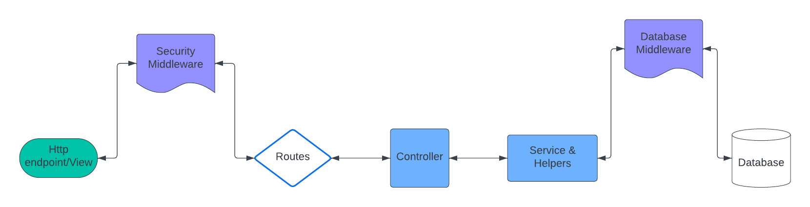

# Volunteer Management System - MERN

### MERN app for volunteers and events tracking

## Project Overview:

_Every hour counts._ When I first started volunteering at school, there was no efficient way of tracking my volunteer record other than Excel spreadsheets.
The Volunteer Management System is a robust and versatile web application designed to streamline the process of managing volunteering events for organizations and community initiatives. This project addresses the need for a user-friendly platform that facilitates volunteer recruitment, coordination, and engagement. Every organization can positively impact our communities with the involvement of each volunteer.

### [Try the App!](https://volunteer-mern.vercel.app/)

### Data Flow

### Sort/Search/Filter Alogrithms!

### Models:

- Event (embedded with EventShift)
- User (both volunteers and administrators)

### Types of middleware:

- Authentication/Authorization: for certain resources, user need to be logged in to view, and for others, only specific roles can access
- Custom error handling: when there's an internal server error from the database, etc.
- Database middleware: for Event model
  - EventShift schema is a nested array of embedded documents inside Event schema
  - EventShift schema contains important properties such as volunteer shift times(i.e., shiftStart, shiftEnd, shiftDuration)
  - Middleware ensures that the correct data structure is being stored every time data gets updated
  - For example, an admin cannot create a shift in which the start time is after the end time. (More examples below)

#### Data validation middleware

1. Remove duplicate dates for an event
2. Validating shift start and end times (including the format of incoming data)
3. Ensure that the positions available for a shift must be set to more than 0 upon creating a shift
4. Ensure that each shift is unique - multiple shifts can be on the same date, but they cannot start and end at the same times
5. Ensure that each shift falls on the same date as at least one of the dates in the "eventDates" property of the parent document

#### Utility middleware (DRY principle) - calculate/genearte some properties of teh model on every update:

1. Calculate duration of shift based on valid start and end times
2. Store "eventDates" and "shiftDates" as a local date string according to OS's local time
3. Calculate total number of positions of a volunteering event based on the event's shifts' positions

### Role-Based Access Control: Different/restricted resources for different authorization statuses

- Anyone (public):

  1. View all events
  2. Sort/Search/Filter events

- Admin:

  1. Add events and shifts
  2. Add (update) shifts to existing events
  3. View non-sensitive info of every volunteer
  4. Sort volunteers according to options (e.g., volunteered hours in ascending hours)
  5. Search volunteers by name

- Volunteer:
  1. Sign up for a shift (if applicable)
  2. Cancel a shift (if applicable)
  3. Update your info (e.g., password)

### Deployment

  * Frontend/client hosted on Vercel
  * Backend/server deployed on Heroku server using GitHubActions CI/CD

**Check out other projects on my [portfolio website](https://www.kaungzinhein.me/)**

_Every hour counts_
